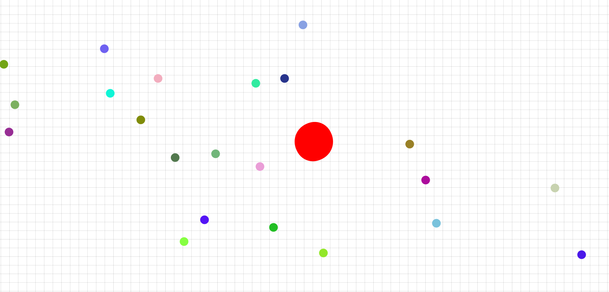

Fake Agar.io
============

Only a copy cat of the famous [agario.io](https://agar.io/?).

**THIS IS ONLY A COPY!!!!** Go and play the original agar.io (I'm a player too),
this small project only has the mere purpose of practicing and lay down some Javascript 2D Game / Canvas
technique and project structure.
Is not for commercial use.

I choose to make a copy-cat of agar.io because the build mechanics are farly simple 
but yet, have many important basic aspect that is a **must learn**.

For instance:

* player control
* player movement
* collision (with walls and other entities)
* enemy / other entity movements
* Shooting 
* 2D camera (camera follows the player)
* Movement smoothing (pressing closer to the player will move the plaeyer slower, opposite when pressing far away)
* Game optimization (there are many things going on on the same time!)